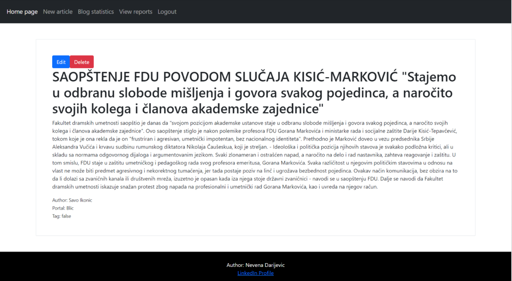

# FakePolitics

FakePolitics is a blog that contains articles from various portals categorized according to truthfulness and credibility. 

In addition to reviewing articles, readers are also allowed to leave comments on them, to filter news by truthfulness or by portals, as well as to report fake news.

The blog administrator is able to add, edit or delete new items. Also, the admin is allowed to view statistics, as well as view the reported content. The admin analyzes the submitted articles and decides whether to add them to the blog and with which tag (true or false).

## Admin pages
Below are a few pages available to the admin.

Home page for admin:

Display article page:

 

Blog statistics page:

Reported news page:

## Reader pages:
Below are a few pages available to the reader.

Filtered by portal page:

 

Report news page:

 

## Prerequisites

You will need [Leiningen][] 2.0.0 or above installed.
The application uses following libraries:

[Compojure][]

[Ring][]

[Monger][]

[Hiccup][]

## Application 

Front: [HTML][], [CSS][]

Back: [Clojure][]

Database: [MongoDB Atlas][] (Cloud database service)

[leiningen]: https://github.com/technomancy/leiningen
[compojure]: https://github.com/weavejester/compojure
[ring]: https://github.com/ring-clojure/ring
[monger]: https://github.com/michaelklishin/monger
[hiccup]: https://github.com/weavejester/hiccup
[MongoDB Atlas]: https://www.mongodb.com/atlas/database
[Clojure]: https://clojure.org/
[HTML]: https://www.w3schools.com/html/
[CSS]:https://www.w3schools.com/css/

## Running

To start a web server for the application, run:

    lein ring server

## References

Daniel Higginbotham (2015), [Clojure for the Brave and True][]

Andrew Meredith [Learn ClojureScript][]

[clojure for the Brave and True]: https://www.braveclojure.com/clojure-for-the-brave-and-true/ 
[Learn ClojureScript]: https://www.learn-clojurescript.com/

## Learn more

If you want to know more, read the following documentation:  

[ClojureDocs][]

[ClojureMonger][]

[Bootstrap][]

[MongoDB][]

[ClojureDocs]: https://clojuredocs.org/
[ClojureMonger]: http://clojuremongodb.info/
[Bootstrap]: https://getbootstrap.com/
[MongoDB]: https://docs.mongodb.com/

## License

Copyright © 2021 [Nevena Darijevic][]

[Nevena Darijevic]: https://rs.linkedin.com/in/nevena-darijević-53876415b

